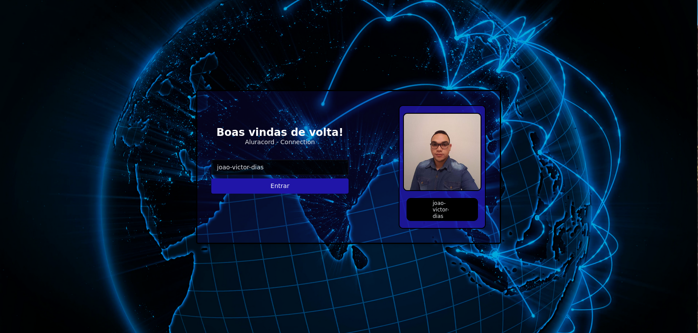
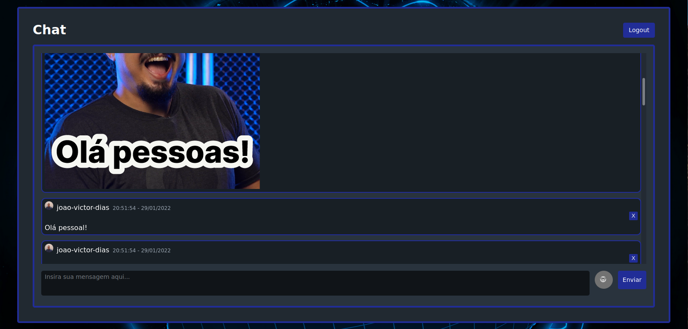

# **Aluracord - Connection**

Projeto desenvolvido durante a Imersão React da Alura. Trata-se de um chat realtime personalizado feito com base a interface do Discord. 

**Deploy Vercel:** http://aluracord-connection.vercel.app/

# Tecnologias utilizadas

<div>
    
    
    
    
    

</div>

# Como utilizar

- Clone o repositório

  ```
  git clone https://github.com/joao-victor-dias/aluracord-connection.git
  ```

- Instale as dependências dentro do repositório do projeto

  ```
  yarn install
  ```

- Inicie o projeto

  ```
  yarn dev
  ```


